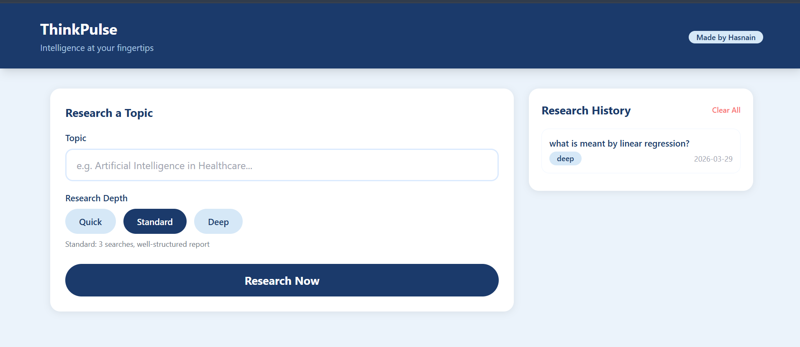

# 🧠 ThinkPulse
### Intelligence at your fingertips


> AI-Powered Research Assistant that automatically searches the web, analyzes multiple sources, and generates structured research reports on any topic in seconds.

---

## 📸 Screenshot



---

## ✨ Features

- 🔍 **Automatic Web Search** — Searches multiple sources simultaneously
- 🧠 **AI Report Generation** — Converts raw data into structured reports
- ⚡ **3 Research Modes** — Quick, Standard, and Deep research
- 📋 **Structured Output** — Executive Summary, Key Findings, Conclusion
- 📁 **Research History** — Save and revisit past research sessions
- 📥 **Download Reports** — Save reports as text files
- 📋 **Copy to Clipboard** — One click copy
- 🌐 **REST API** — Fully documented FastAPI backend

---

## 🛠️ Tech Stack

| Layer | Technology | Purpose |
|---|---|---|
| Backend | FastAPI, Python 3.11 | REST API and server |
| AI / LLM | Groq (Llama 3.3) | Report generation and analysis |
| Web Search | Tavily Search API | Real-time web information retrieval |
| AI Framework | LangChain | LLM and search tool integration |
| Frontend | HTML, Tailwind CSS | User interface |
| Deployment | HuggingFace Spaces | Live hosting |

---

## 🚀 API Endpoints

| Method | Endpoint | Description |
|---|---|---|
| GET | `/` | Web UI |
| GET | `/health` | API health check |
| POST | `/research` | Research a topic |
| GET | `/history` | Get research history |
| DELETE | `/history` | Clear all history |
| GET | `/history/{id}` | Get specific history item |

---

## ⚙️ How to Run Locally

**1. Clone the repository:**
```bash
git clone https://github.com/HafizJee786/thinkpulse.git
cd thinkpulse
```

**2. Create virtual environment:**
```bash
python -m venv venv
venv\Scripts\activate
```

**3. Install dependencies:**
```bash
pip install -r requirements.txt
```

**4. Create .env file and add your API keys:**
```bash
GROQ_API_KEY=your_groq_api_key
TAVILY_API_KEY=your_tavily_api_key
```

**5. Run the app:**
```bash
uvicorn app.main:app --reload
```

**6. Open in browser:**
```
http://127.0.0.1:8000
```

---

## 🔑 API Keys Required

| API | Get it from | Free Tier |
|---|---|---|
| Groq API | [console.groq.com](https://console.groq.com) | Yes - Free |
| Tavily API | [tavily.com](https://tavily.com) | Yes - 1000 searches/month |

---

## 👨‍💻 Author

**Hafiz Ali Hasnain**
🔗 [GitHub](https://github.com/HafizJee786)

---

## 📄 License
This project is open source and available under the [MIT License](LICENSE).
